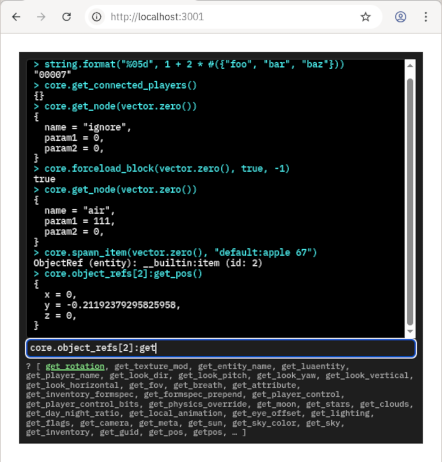

## Luanti Developer Console



This mod provides a developer console (REPL) for Luanti inside a web browser.

**First time setup**:
1. Run `npm install` in this folder
2. Add "developerconsole" to your `secure.http_mods` in the Luanti settings

**To use**:
1. Enable `developerconsole` mod in your world
2. Start server application using `node server.js` (you can leave it running in the background)
3. Launch Luanti game or server
4. Open http://localhost:3001/ in your browser, happy hacking!

### Quick guide

The console will try to auto-complete/preview the Lua expression at the current cursor
position, as long as it's safe to do so (no side-effects).

Table keys will be shown in a list-like format inside square brackets. So if you see
`[ foo, bar, baz ]` that means the Lua table looks like `{ foo = ..., bar = ..., baz = ... }`.

In addition the symbol to the left of the preview text will be either **`?`** or **`=`**.
An `=` will be shown if the expression was valid and non-nil, and the preview will show that value.
In case of `?` the preview will show you the value of the valid expression *so far*, as well as table keys that *could be* inserted to form a valid expression.


### License

```
Copyright (C) 2026 sfan5 <sfan5@live.de>

This library is free software; you can redistribute it and/or
modify it under the terms of the GNU Lesser General Public
License as published by the Free Software Foundation; either
version 2.1 of the License, or (at your option) any later version.

This library is distributed in the hope that it will be useful,
but WITHOUT ANY WARRANTY; without even the implied warranty of
MERCHANTABILITY or FITNESS FOR A PARTICULAR PURPOSE.  See the GNU
Lesser General Public License for more details.

You should have received a copy of the GNU Lesser General Public
License along with this library; if not, see
<https://www.gnu.org/licenses/>.
```

### AI notice

For me this was the first software project made using direct involvement of AI/LLM.
I used the VS Code plugin that integrates with GitHub Copilot, both inline suggestions
and the chat feature (that lets AI directly edit your code).

But don't worry, it's not *vibe coded*.
